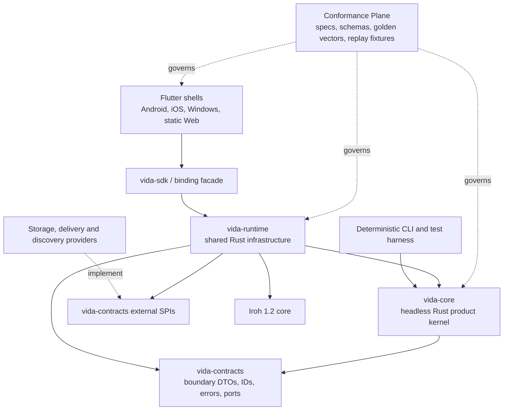

# Architecture Spine — VIDA shared-core, transport and replicated-state foundation

## Design Paradigm

**Headless local-first shared core with native/platform shells and ports-and-adapters at external seams.** `vida-core` owns cross-platform product and protocol semantics; `vida-runtime` hosts shared infrastructure; native/platform shells own presentation and OS policy; the language-neutral Conformance Plane governs every implementation.



## Inherited Invariants

| Inherited | From parent | Binds here |
|---|---|---|
| ADR-0001 | Layered access control | Authorization remains application policy, not transport state |
| ADR-0002 | Default role presets | Transport and sync MUST NOT encode role presets as protocol authority |
| ADR-0003 | Offline revocation | Removal affects future authorization; offline devices may retain old plaintext |
| ADR-0004 | Multi-axis identity | `PersonaId`, `DeviceId`, `EndpointId`, `ServiceAccountId` stay distinct; corporate account context does not expose private identifiers or revoke unrelated Personas; Persona/controller choice remains OQ-0049 |

## Invariants & Rules

### AD-1 — Iroh transport foundation [ADOPTED]

- **Binds:** `VidaNodeHost` and the logical transport contract used by every networked client profile and service.
- **Prevents:** incompatible transports and endpoint lifecycles selected by separate Apps.
- **Rule:** Iroh core 1.2 is the mandatory transport foundation inside `vida-runtime`, not an interchangeable product plugin; `VidaNodeHost` owns Router, Endpoint, Address Lookup, relay policy and platform network lifecycle. All peer-data profiles are direct-first with VIDA-operated Iroh-compatible encrypted relay fallback; native profiles also support relay-disabled LAN/known-address operation. Web direct is an unproven Release-1 gate: the target is a version-pinned WebRTC custom transport **inside Iroh/VidaNodeHost**, not parallel domain sync; stock Iroh/Wasm is relay-only, and older experimental bridges do not prove Iroh 1.2 compatibility. Lookup/SDP/ICE signaling may use relay, but encrypted application payload uses relay only after an authenticated direct attempt is unavailable or exceeds a bounded prototype-measured budget. Explicit VIDA relay configuration must not retain an unintended N0 default. Direct evidence excludes TURN/relay candidate pairs; path selection, encrypted relay forwarding, receipt and idempotent migration require fixtures. If the Web direct gate fails, Web Release 1 is blocked pending a new explicit architecture decision, not silently degraded to relay-first. Address Lookup, signaling, relay forwarding, mailbox and authority are distinct; version upgrades and optional higher-level libraries cross conformance and migration gates.

### AD-2 — VIDA owns application protocols [ADOPTED]

- **Binds:** all client↔client, client↔node and node↔node protocols.
- **Prevents:** domain models becoming coupled to pre-1.0 `iroh-*` protocol crates.
- **Rule:** every protocol uses a VIDA-owned versioned ALPN and envelope. The Conformance Plane owns language-neutral schemas, compatibility rules, byte-exact golden vectors, replay/negative-security fixtures, versioned product-behavior scenarios and platform-appropriate accessibility criteria. A versioned manifest maps each release target and compatibility tuple to immutable mandatory suite digests; CI publishes machine-readable evidence. Blobs, gossip and docs may appear only behind controlled adapters.

### AD-3 — Endpoint profiles are policy-managed [ADOPTED]

- **Binds:** identity, privacy, device lifecycle and `VidaNodeHost`.
- **Prevents:** treating `EndpointId` as Persona and correlating anonymous contexts through one persistent endpoint.
- **Rule:** ordinary/federated device profiles use persistent endpoints with revocable `EndpointBinding`/`DeviceGrant` and explicit endpoint-key rotation; anonymous/session contexts MUST use isolated ephemeral endpoints scoped by an explicit unlinkability policy. Otherwise-unlinked private and corporate account contexts MUST NOT share an observable endpoint/binding that discloses their co-location. Transport-key lifecycle and authorization revocation remain separate operations.

### AD-4 — One operation across direct and durable paths [ADOPTED]

- **Binds:** Messenger, Notes, Projects, membership and every durable mutation.
- **Prevents:** duplicates, split authority and crash loss when direct and mailbox delivery race.
- **Rule:** both paths carry the same signed operation ID/envelope. One `vida-runtime` application service owns mutation: `vida-core` validates against a named base frontier and returns deterministic canonical operation/effects; the origin durability transaction records operation intent, outbox, dedupe state and origin-durable frontier. The authority-accepted frontier advances only on evidence satisfying the selected Space/object operation policy; it MAY coincide with the origin transaction when that origin is the authority. Receivers verify, deduplicate and apply idempotently. Shells and providers cannot write accepted log/frontier/outbox state directly.

### AD-5 — Delivery state is not domain authority [ADOPTED]

- **Binds:** `DurableDelivery`, receipts and projections.
- **Prevents:** mailbox state or read receipts becoming the source of truth.
- **Rule:** delivery ACKs are namespaced `delivery.accepted`, `delivery.stored`, `delivery.applied`, `delivery.read`; `delivery.accepted` means origin log+outbox commit and MUST NOT be interpreted as `authority.accepted`; mailbox copies are encrypted transport cache and only a validated domain/control log under the Space authority policy is authoritative.

### AD-6 — Membership and epochs belong to Space [ADOPTED]

- **Binds:** `SpaceMembership`, key distribution and authorization.
- **Prevents:** connection success or endpoint possession granting application access.
- **Rule:** signed `WorkspaceGenesis` establishes the creator as initial Owner; thereafter signed Space policy grants roles/capabilities and only an explicit current built-in Owner may appoint another Owner in a shared Space, subject to any applicable critical-policy quorum. The same Owner may unilaterally remove another Owner from a shared Space without co-owner approval or M-of-N; an Owner-cloned custom role confers no reserved Owner-governance capabilities. Personal Space retains exactly one Owner, so adding a second is invalid. Admin with Space-level `manage_members` may assign Admin and lower roles but cannot assign/promote/remove/demote Owners or edit Owner-governance policy. Owner appointment and removal are outside resource ACL inheritance/hard-deny at every level and cannot be bypassed through a command alias. Space authority validates the initiator's current role and applicable policy/quorum at acceptance, serializes the change, preserves Owner cardinality, and atomically accepts membership removal plus revocation of all removed-member Space grants and derivative delegations; affected future-access key epochs advance without old-grant authorization for new operations. A compliant client that learns effective removal locks/hides managed Space data, invalidates local grants/key handles and starts best-effort managed-cache purge; an offline device, existing OS banner or previously copied plaintext cannot be remotely erased.

### AD-7 — Data planes are separated by semantics [ADOPTED]

- **Binds:** `SyncLog`, `BlobStore`, presence and live collaboration.
- **Prevents:** transient gossip being mistaken for durable history or large payloads bloating the operation log.
- **Rule:** gossip/datagrams carry transient signals; signed operations carry durable mutations; immutable large content uses verified resumable blob transfer plus manifests.

### AD-8 — Compatibility has independent axes [ADOPTED]

- **Binds:** releases, migration and conformance.
- **Prevents:** a compatible Iroh core being mistaken for compatible VIDA state/protocols.
- **Rule:** every release publishes one compatibility tuple containing core/API version, native FFI and Web Rust/Wasm binding API, ALPN major/features, operation/envelope features, persisted and snapshot schema, adapter versions and platform capability profile. Conformance tests every supported mixed-version tuple, upgrade, atomic/partial rollout, stale-downgrade rejection and forward repair; feature activation and irreversible migration boundaries are explicit. Breaking protocol changes require a new ALPN major.

### AD-9 — Platform asymmetry is explicit [ADOPTED]

- **Binds:** supported installed mobile/desktop clients and static Web client.
- **Prevents:** claiming identical P2P/background behavior on incompatible runtimes.
- **Rule:** each supported installed OS client has separate lifecycle, key-storage, wake-up and recovery conformance gates; the Release-1 Web profile has separate origin/code-delivery trust, storage/quota/eviction, key, lifecycle, direct/relay path, AppPackage-execution and browser-security gates. No platform shell may infer always-on network or background execution from another platform.

### AD-10 — Copyleft boundaries require explicit review [ADOPTED]

- **Binds:** third-party reuse.
- **Prevents:** confusing reference-pattern reuse with permission to embed code.
- **Rule:** each direct and transitive component appears in the release SPDX inventory with exact version/checksum and integration mode; MPL, GPL and AGPL obligations are reviewed separately; clean-room provenance is retained for ideas-only reuse.

### AD-11 — Headless shared core and platform-shell boundary [ADOPTED]

- **Binds:** Messenger, Notes, Projects, system Apps, `vida-core`, `vida-runtime` and supported installed/Web shells.
- **Prevents:** duplicated domain semantics, platform-specific protocol behavior, a shared UI runtime becoming the architectural center, and OS policy leaking into the product kernel.
- **Rule:** within the first-party VIDA distribution, `vida-core` is the single headless Rust implementation of cross-platform domain invariants, commands, deterministic transitions, authorization evaluation, signed-operation validation, canonical serialization and projections. It has no compile-time dependency on `vida-runtime`, network, OS lifecycle or a concrete database. First-party `vida-runtime` depends on and drives core, hosts Iroh/delivery/sync/blob/storage orchestration and exposes one production `vida-sdk`/binding facade through platform-specific native FFI or browser Rust/Wasm packaging; first-party shells MUST NOT call core and runtime independently. Every normative command and observable transition is executable through a deterministic headless API and reference CLI/test harness with injectable time, randomness, effects and replay. Shells own UI, navigation, accessibility, lifecycle, notifications, permissions, secure-store handles or browser key custody, energy policy, diagnostics and packaging. An alternative semantic implementation **inside a first-party release** requires a time-bounded waiver ADR and differential property/fuzz/replay testing against the Rust reference. Independent third-party client/node implementations require no VIDA waiver: they follow public specifications and conformance under AD-17, without weakening signature, authorization, membership or persistence semantics.

### AD-12 — Observable contracts have one owner [ADOPTED]

- **Binds:** wire/signature input, FFI/API DTOs, persisted logical state, snapshots, projection checkpoints, imports and exports.
- **Prevents:** private Rust layouts or hand-written platform mappings becoming incompatible public contracts.
- **Rule:** the Conformance Plane registers every observable boundary with stable `ContractId`, version, field/null/default/bounds rules, ID/time/Unicode normalization, unknown-value behavior and migration semantics. `vida-contracts` contains semantics-free boundary DTOs, IDs, errors and port traits. Private memory and physical database layouts remain implementation details; generated bindings are preferred and hand-written mappings pass bidirectional and unknown-value preservation fixtures.

### AD-13 — Runtime owns transaction and recovery orchestration [ADOPTED]

- **Binds:** `SyncLog`, derived materialized state, outbox, dedupe/frontier state, projections and recovery.
- **Prevents:** shell/provider writes, inconsistent accepted/read states and divergent crash outcomes.
- **Rule:** validated signed operations and snapshots carry durable domain history; only the subset accepted under the selected Space/object operation policy is authority-accepted state. Local and received-operation pipelines are versioned state machines owned by `vida-runtime`; origin operation intent, outbox, dedupe and origin-durable frontier commit together, while authority-accepted frontier advances only on separate acceptance evidence unless origin is itself the authority. Browser storage is a separate provider and MUST prove the same observable transaction/replay semantics where the platform permits; eviction, quota failure or loss of browser profile cannot be represented as successful remote replication or guaranteed backup. Tentative local projections MUST remain distinguishable from accepted state. Received-operation apply/replay never reissues the originating business command or creates new business intent merely because state arrived; committed-fact reactions, timer/external signals and passive UI projections are distinct entry classes. If one fact accepted under the selected authority policy leads an AppInstance rule to create a durable Space resource, the source fact binds the effective immutable rule version and all devices MUST converge on one logical resource, not one per local evaluation or local package version; the version-binding point, executor and canonical ID path remain `OQ-0048`. A later package update does not reprocess the old fact as a new command. Every materialized state and projection is derived, rebuildable and tagged with its source frontier. Read APIs either satisfy the declared minimum frontier/read-your-writes contract or report lag; a runtime is not ready until required replay reaches its readiness frontier. Crash-point replay fixtures MUST yield identical log/frontier and derived-state hashes for every supported provider.

### AD-14 — External ports provide mechanism, not product semantics [ADOPTED]

- **Binds:** storage, delivery, discovery and platform-provider SPIs.
- **Prevents:** replacing a provider from changing authorization, ordering, conflict, retry or acknowledgement semantics.
- **Rule:** every port charter versions capabilities, atomicity/consistency, idempotency, cancellation, timeout, error taxonomy, metadata exposure and failure injection. Providers implement mechanism only; authority, causal ordering, conflict resolution, canonical serialization, idempotent apply and domain acknowledgement remain in core/runtime. Provider substitution requires the common conformance suite.

### AD-15 — Operational ownership and readiness are explicit [ADOPTED]

- **Binds:** hosted, federated and self-hosted deployments across development, staging and production.
- **Prevents:** unowned ciphertext, control ordering, local recovery, secrets, upgrade and restore responsibilities.
- **Rule:** every deployment names owners for client/runtime endpoint lifecycle and local recovery, VIDA-operated relay/lookup availability and metadata, durable-delivery ciphertext/quota/abuse/deletion evidence, and Space-authority ordering/authorization receipts. Static Web promotion publishes a coherent versioned Flutter assets + Rust/Wasm + protocol/schema compatibility bundle; mixed cached assets MUST NOT silently execute an incompatible client. Production promotion requires secret-safe typed telemetry, environment-specific configuration, upgrade/rollback evidence and tested backup/restore where durable server state exists; provider and numeric SLO choices may remain deferred. This technical spine is not public-release authorization: PRD OQ-5–OQ-7 separately gate named legal/controller, store-account and signing-key custody, incident/disclosure authority, independent security assurance disposition and localization review ownership before store submission/security claims.

### AD-16 — Shared Space rights reconciliation is cross-app [ADOPTED]

- **Binds:** `SpaceMembership`, `vida-core` authorization, `vida-runtime` local read gate and all platform shells/Apps.
- **Prevents:** Messenger, Notes, Projects and other clients diverging on rights reconciliation or treating a mutation lease as a read timeout.
- **Rule:** one rights-reconciliation interval of seven days applies across Apps, risk classes and roles in a shared Space, including shared Owners. Synchronized content remains locally readable when connectivity drops before expiry, including `critical` documents; after expiry without authority-confirmed control refresh, cached shared read locks until reconciliation. UI, search, notifications, export, runtime/API, projections and plugin/automation enforce any received effective revocation immediately. A relay connection, restart, local activity, old control head or clock rollback does not count as a refresh. Personal Space Owner retains its separate offline-read default; `OQ-0063` is closed with no shared Owner exemption. Remote erasure of a disconnected device cannot be promised. Cross-platform freshness/anti-rollback proof remains `OQ-0053`; absence of age-only mutation expiry is AD-18.

### AD-17 — Open interoperability covers clients, nodes and Apps [ADOPTED]

- **Binds:** VIDA protocol publishers, `VidaNodeHost`, `vida-core`, `AppPackage`/runtime, external repositories, Conformance Plane and release manifests.
- **Prevents:** a nominally open core requiring private wire contracts, hidden mandatory extensions or private tests for independent clients, nodes, Apps or plugins.
- **Rule:** every claimed interoperable baseline registers a versioned profile with mandatory capabilities and dependency closure, publishes normative behavior/wire/security contracts, machine-readable schemas where applicable, golden and negative-security vectors, compatibility rules, test suite and release evidence. No hidden or paid-only dependency may be mandatory for the open baseline. Independent client/node and schema-driven App/managed-extension implementers have the same documented conformance path without a first-party waiver or paid VIDA tenant/marketplace credentials; tests cover cross-vendor pairs, not only reference↔independent pairs. Public change history and external proposals are supported. A plugin is a managed extension under ADR-0007–0009, not arbitrary host code; package conformance never grants publisher trust, Space consent or network egress. Access to private Spaces, hosted services or curated marketplace is not implied. Paid implementations may remain closed, but their interoperability-facing contracts cannot be secret. ADR-0005 Iroh/VIDA ALPN remains binding; exact publication license, IPR and governance are `OQ-0055`.

### AD-18 — Offline candidates have no age-only expiry [ADOPTED]

- **Binds:** `vida-runtime` pending/outbox state, `SpaceMembership`, authority acceptance, `SyncLog` and every schema-driven App.
- **Prevents:** a locally durable edit disappearing or being rejected solely because one client was offline longer than a risk-class timer, and an old candidate bypassing current authorization.
- **Rule:** an offline mutation candidate, including a staged control mutation, can remain pending indefinitely across all risk classes; age alone never accepts, rejects or quarantines it. On reconnect, current Space/object/action rights, control state, grant/epoch, signature, schema, causal and business preconditions are revalidated at the actual authority-acceptance point. A current Owner can work offline in an owned Personal or shared Space without a candidate-age limit; the seven-day shared-read lock still applies to shared Owners under AD-16. Personal Space can accept under its Owner policy locally without other members or server approval; an owned shared Space still requires its applicable authority policy. Revoked/invalid candidates remain recoverable but cannot auto-merge. Membership, role, policy and key changes require authority acceptance before taking effect; merely staging one offline changes no access. A grant's expiry does not erase a pending candidate or constitute an unlimited credential. Re-sign/rebase and concurrent-conflict semantics remain `OQ-0033`/`OQ-0034`; shared-read proof remains `OQ-0053`.

### AD-19 — Comparable first acceptance and concurrent conflict [ADOPTED]

- **Binds:** task-status operation family, `SyncLog`, `SpaceAuthority`, task projections and conflict UX.
- **Prevents:** two offline status changes from the same prior task state silently overwriting each other or deriving priority from client clocks or transport arrival.
- **Rule:** for mutually exclusive proposals from the same base, the first accepted proposal has precedence **only when the acceptances share a verifiable causal/order relation**. A competing stale proposal remains recoverable and visible only to an actor still authorized for that view; it cannot silently replace the accepted state. A new intentional transition based on the resulting state remains possible. `delivery.accepted`, raw receive and client timestamp do not establish this order. Disconnected peers can have incomparable local acceptances; they MUST NOT assert a global first or device priority. AD-21 binds peer equality, while `OQ-0033`/`OQ-0034` must define deterministic operation-family convergence, proof and UX for concurrent alternatives before implementation.

### AD-20 — Release-1 Flutter clients include static Web [ADOPTED]

- **Binds:** first-party product distribution, platform shells, AppPackage rendering and client conformance.
- **Prevents:** separate teams shipping a non-sync browser companion, treating static hosting as a paid App server, or choosing incompatible Windows presentation stacks.
- **Rule:** first-party Release 1 ships full-featured installed Flutter Android, iOS and Windows clients under ADR-0020 **and** a statically hosted Flutter Web client under ADR-0021. Native and Web use the same Rust Core semantics, with browser Rust/Wasm, storage/key, lifecycle, accessibility, media and direct/relay-path conformance separate from native FFI/OS profiles. An authorized Web Device syncs permitted Spaces with peers on a verified direct path where reachable, otherwise through VIDA-operated encrypted relay fallback, without paid Hosted Space; browser direct capability is a prototype gate, not an inherited Iroh/Wasm feature. If neither path works, locally available permitted data/actions remain usable when a valid local shell/JS/Wasm and data are present, while remote delivery/authority acceptance stays pending. The static host is not business authority but can replace executable browser code and expose client plaintext; Web is not zero-knowledge relative to a compromised host. Offline cold reopen, browser storage eviction, quota exhaustion and recovery/export are explicit Web proof cases; a successful local transaction never implies immunity from later browser-profile deletion. Web manually creates/syncs Contact Cards but does not promise system address-book import. A closed/suspended tab has no guaranteed background call, reminder or sync; pending state reconciles on reopen. A Web build that cannot pass the applicable Core-App/call and security gates is not a Release-1 companion substitute. WinUI 3/C# and paid Hosted Space remain separate later work; City Portal public web remains a different product.

### AD-21 — Equal device peers, causal convergence [ADOPTED]

- **Binds:** `vida-core`, `vida-runtime`, `SyncLog`, `SpaceMembership`, platform shells and conformance.
- **Prevents:** a phone/laptop, Iroh endpoint, replica ID or first connection being treated as Owner/master/arbiter of another authorized device of the same Persona.
- **Rule:** Owner/Admin is a Space-member/Persona role, never a device rank. All authorized devices of one Persona are equivalent sync peers: each may durably stage and exchange operations under its last verified grants, but an offline grant is not proof of current authorization. Peers with the same validated data operations **and control/acceptance evidence** MUST derive identical state/conflict variants regardless of delivery order or platform. Distinct replica/session IDs represent causality/deduplication, not higher authorization or business priority; an ID-based visible winner cannot silently become a domain-priority rule. No designated device may issue globally final acceptance merely because it is a selected peer. Incomparable concurrent conflicts require the same schema-level convergence rule on every peer; its precise semantics and provisional UX remain `OQ-0033`/`OQ-0034`.

### AD-22 — Explicit multi-value conflict for concurrent task status and file replacement [ADOPTED]

- **Binds:** task-status and file-replacement operation families, `SyncLog`, `BlobStore` payload/pin retention, core projections, client conflict UX and conformance fixtures.
- **Prevents:** a CRDT/library tie-break, replica ID or packet arrival silently choosing a business winner for causally incomparable incompatible changes.
- **Rule:** after peers reconcile two incompatible task-status changes or file replacements whose **authority-accepted branches have no shared verifiable order**, both durable alternatives form one explicit unresolved multi-value conflict; there is no canonical current winner. Concurrently authored operations whose authority acceptances *are* comparably ordered follow AD-19 for task status and `REQ-SYNC-007` for file replacement. An invalid/revoked pending candidate remains recoverable under its rights policy but is not projected as an accepted shared variant merely because it arrived by sync; exact acceptance proof remains `OQ-0033`. Both accepted file payloads/references stay pinned under the retention policy until a safe retention frontier, not merely until one peer locally resolves; frontier mechanics remain `OQ-0034`. Viewing each variant requires current read authorization. A currently authorized actor resolves by a new operation causally based on both alternatives, subject to current Space/object/action rights and preconditions; an ordinary library assignment must not silently clear the business conflict. If two authorized resolution operations with incompatible outcomes are independently authority-accepted offline and their acceptances remain incomparable, reconciliation creates a new explicit multi-value conflict between those resolutions, without a winner; the next resolution must causally cover both current resolution heads and recheck current rights. Comparably accepted resolutions follow AD-19 or `REQ-SYNC-007`, as applicable. Merely applying the reconciled history does not re-execute the original business command. Independent text edits still auto-merge. AD-23 governs equivalent resolutions, late branches, resolution visibility and file preservation actions. Exact proof, wire encoding, capability mapping and rules for other operation families remain `OQ-0033`/`OQ-0034`.

### AD-23 — Conflict continuations preserve alternatives [ADOPTED]

- **Binds:** `SyncLog` conflict projection, `BlobStore`, resource ACL, file revision/copy commands and client conflict UX.
- **Prevents:** duplicate visible outcomes, loss of late accepted branches, unauthorized viewing/resolution and early blob collection.
- **Rule:** independently accepted resolutions with provably identical canonical business outcome and effects collapse to one visible result while both operations and attribution remain in causal/audit history; uncertain equivalence is not silently coalesced. A later-arriving valid accepted incompatible branch outside the prior resolution's causal base reopens explicit conflict without a winner **only when its authority acceptance is incomparable with that resolution**; comparable acceptance follows AD-19 or `REQ-SYNC-007`. Resolving requires current action permission and read permission to every variant used; an actor lacking either sees no restricted payload. A local resolution alone cannot unpin live alternatives; safe retention frontier remains `OQ-0034`, and storage pressure must be communicated. File conflict UX exposes two distinct authorized actions: same-resource revision or separate resource copy with its own ID and access check; neither silently replaces the primary file. Exact equivalence, frontier, metadata inheritance and wire semantics remain `OQ-0034`.

### AD-24 — Irreversible effects wait for domain confirmation [ADOPTED]

- **Binds:** AppInstance effect intent, runtime executor, task-status transitions and external integrations.
- **Prevents:** a locally staged or merely delivered `Done` from prematurely sending an irreversible message or triggering duplicate business effects.
- **Rule:** irreversible external effects remain pending until the source transition has applicable Space/object authority confirmation and no known unresolved conflict. Transport ACK and local durability are insufficient. Execution and replay require separate idempotency and authorization checks; a later unknown branch cannot be ruled out by a local peer, so exact confirmation proof, external-outcome reconciliation and third-party guarantees remain `OQ-0033`/`OQ-0045`. If an operation from outside the effect's causal confirmation frontier creates conflict after completion, preserve the audit fact and open correction workflow for that branch's actor. Arrival/clock does not assign blame; if several incomparable outside-frontier branches exist, no single actor is selected until explicit resolution. No fictional cancellation or silent undo is available. VIDA-to-VIDA request outcomes are request-ID-bound durable signed state transitions delivered by normal synchronization, not inferred from transport ACK; third-party APIs without durable status/idempotency remain a separate `outcome_unknown` case.

### AD-25 — Agent conflict authority is opt-in [ADOPTED]

- **Binds:** agent-assisted status/file resolution, app automation policy, authorization and audit.
- **Prevents:** a default AI suggestion or stale delegation silently becoming an authorized domain change.
- **Rule:** conflict detection/merge is a global system capability, not an ACL permission or optional plugin; there is no universal `resolve_conflict` capability. A resolution is a normal domain operation authorized by its resource/action permission plus read access to every required variant. Agents suggest by default. General automation opt-in does not silently include conflict arbitration until its conflict-context scope is explicitly defined; any auto-submit remains an ordinary domain action audited with bound heads, agent/delegator identity, scope and current rights. Consent mapping, expiry, delegation, revocation and execution limits remain `OQ-0045`.

### AD-26 — Profile presence and sync outcome are separate [ADOPTED]

- **Binds:** profile presence, client status indicators, `SyncLog` and identity contexts.
- **Prevents:** treating internet connectivity, a transport ACK, a second local copy and domain acceptance as one status or leaking a cross-Persona device total.
- **Rule:** the online-device count belongs to one visible user profile, not to an aggregate Space; every viewer of that profile, including an anonymous profile, may see that profile's count. No otherwise-unlinked private, corporate or anonymous Personas may be combined into one public count. Count includes the current user-controlled device when its proof is fresh; bots, ServicePrincipals and AppCenter peers are shown separately. A device counts as online only under a fresh authenticated VIDA application-level sync-capability proof by direct or usable relay path: Iroh `Endpoint::online`, an address or QUIC ACK alone is insufficient. A Web tab/profile is a Device only after ControllerState enrollment and the same application proof on its current direct or relay path; page visibility or transport connection alone is insufficient. Without current proof it is immediately excluded from public count; internal `reconnecting` is visible only to that device's owner. A one-device Persona may be profile-online while its new operation is still only locally saved. User-facing «синхронізовано» requires an application receipt for the declared replication scope, but is not proof of Space authority acceptance or completion of an external effect. A second device of the same Persona proves another durable copy, not another independent business-authority vote. Exact freshness/expiry and retry thresholds are measured per Android/iOS/Windows/Web prototype rather than chosen as one arbitrary constant; single-device proof, receipt fields and measurement gates remain `OQ-0064`. Raw device/endpoint identity and cross-Persona correlation remain forbidden.

### AD-27 — Offline chat publishes at shared publication time [ADOPTED]

- **Binds:** Messenger group chat, project-linked chats/forums and client history ordering.
- **Prevents:** an offline message silently appearing earlier in an already-read shared conversation merely because its author's device recorded an earlier creation time.
- **Rule:** a message written offline joins shared conversation order and receives its primary displayed timestamp when it is published after synchronization. The example written at 10:00 and published at 13:00 is shown at 13:00; original written-at may remain audit/detail metadata. Canonical order follows causal/topological publication order; concurrent incomparable publications use a deterministic canonical operation-ID tie-break. Millisecond publication time from the application receipt is visible metadata, not the sole order key; sender wall clock and per-client arrival order never decide. Exact receipt fields and epoch/frontier encoding remain `OQ-0065`.

### AD-28 — Installed clients are continuous-sync/online-first [ADOPTED]

- **Binds:** Android, iOS and Windows lifecycle adapters, `VidaNodeHost`, durable pending queues, profile presence and sync UX.
- **Prevents:** treating offline as the intended steady state, inventing mobile background guarantees the OS does not provide, or using overlays/transport readiness as false proof of application sync.
- **Rule:** while the platform permits execution, a client maintains or promptly restores authenticated VIDA/Iroh connectivity and reconciles durable pending state. Loss of synchronizability is an explicit degraded exception. Desktop may keep a persistent connection while its process/service is active. Android high-availability is an optional per-device mode exposed in onboarding and settings. For a consented Public Persona, the baseline may use FCM wake, reconnect and WorkManager reconcile; iOS may use APNs/background tasks and foreground reconnect, but counts online only while active with a controlled VIDA connection. An Autonomous anonymous Persona never registers an external push/wake binding: it relies on direct reachability and OS-permitted reconnect, with unavailable background delivery shown honestly. Network-change/foreground signals enter `VidaNodeHost`; Iroh direct/relay path migration precedes bounded application reconnect with jitter. No release may claim literal 100% mobile background availability, and no overlay/floating-window permission is required for baseline correctness. Conformance must reject any anonymous-profile FCM/APNs registration or cross-Persona wake correlation (`REQ-ID-018`).

### AD-29 — AppPackage updates are forward-only and instance-scoped [ADOPTED]

- **Binds:** AppPackage repositories, `AppInstance`, schema migration, host compatibility and installed shells.
- **Prevents:** one incompatible App disabling all VIDA, an external publisher silently gaining auto-update trust, and ambiguous rollback meaning.
- **Rule:** update modes are `compatible-auto`, `security-auto`, `manual` and `pinned`; bundled first-party Apps default to compatible/security auto, while external sources default to manual until publisher trust is explicit. Owner/Admin with ordinary App-management authority selects the AppInstance mode. Activation performs signed compatibility/migration preflight and commits package, current schema and converter set atomically. A failed gate cannot activate partially and surfaces an actionable error. After successful activation there is no package/schema downgrade or runtime fallback flow in the current baseline; an observed post-activation defect is a release nonconformance, not a designed operating state. TUF-style anti-rollback against stale/revoked metadata remains mandatory. An incompatible client blocks or makes read-only only the affected AppInstance; the remaining VIDA client continues.
- **Compatibility rule:** `compatible-auto` may change UI, add optional/defaulted fields or optimize managed logic only when existing data, declared workflows, dependency contracts, supported host API and authorized outcomes remain forward-compatible. A new mandatory capability, breaking schema/converter, dependency-contract expansion or newly reachable data scope is not `compatible-auto`.

### AD-30 — Package publisher and Space authority are orthogonal [ADOPTED]

- **Binds:** VIDA marketplace identity, package signing, `Developer`, Space membership and `AppInstance` authorization.
- **Prevents:** a package author obtaining customer data access merely by publishing/updating software, or Space Owner/Admin being confused with software authorship.
- **Rule:** `Developer` is a marketplace-level publisher role that may publish and maintain `AppPackage`; it grants no membership, keys or data access in any Space. `Owner` and `Admin` are Space roles for users of an activated AppInstance. One Persona may hold both independently—for example, publish an App and activate it in their own Space as Owner—but every Space capability still derives only from that Space's membership and ACL. Exact publisher verification and which Space role may activate schema remain `OQ-0041` and `OQ-0039`.

### AD-31 — Confirmation is a durable Core contract, not a delivery flag [ADOPTED]

- **Binds:** confirmation-required resources, `exclusive-claim`, approval workflows, sync projections and irreversible effects.
- **Prevents:** showing an offline save or Iroh delivery ACK as business confirmation, losing the authority decision on reconnect, or letting a package replace security/governance rules.
- **Rule:** a confirmation-required operation is first durably saved as an unconfirmed candidate. AppPackage/schema supplies an optimal default policy without imposing a non-configurable minimum approval level; Space Admin selects a Core-supported effective mode. The named resource authority decides under that mode, while Core always validates current rights, preconditions and semantic class. Acceptance/rejection/expiry is a separate signed outcome operation causally bound to the candidate. Receiving and applying that outcome on the requester is a mandatory idempotent sync fact. AppPackage logic cannot redefine resolver code, Owner/Admin, membership revocation, key revocation/rotation or control-log invariants.

### AD-32 — A complex App may have a dedicated compositional Space [ADOPTED]

- **Binds:** AppPackage activation, Space creation, bundled dependencies and product-level navigation.
- **Prevents:** equating every small AppInstance with a Space, or rebuilding Messenger/Notes/Projects inside each complex product App.
- **Rule:** a complex published App may offer creation of a dedicated Space whose primary AppInstance defines the product context and whose Messenger, Knowledge/Notes and Projects/Tasks capabilities are dependent standard AppInstances. The activating user signs ordinary `WorkspaceGenesis` and becomes initial Owner; AppPackage and Developer gain no security ownership. That Space uses ordinary VIDA membership, keys, permissions and sync. Simple extensions and auxiliary Apps may remain AppInstances inside an existing Space.

### AD-33 — iOS v1 executes declarative packages only [ADOPTED]

- **Binds:** iOS package loader, capability negotiation, marketplace compatibility metadata and conformance fixtures.
- **Prevents:** treating Apple 4.7 as blanket approval for Rhai/Wasm/JavaScript payloads or silently advertising Windows/Android executable tiers on iOS.
- **Rule:** iOS v1 accepts signed schemas, forms, layouts, workflows and references to built-in VIDA runtime capabilities; it rejects downloadable application-code handlers. An Apple Guideline 4.7 HTML5/JavaScript mini-app catalog is a separate future contour with its own sandbox, host API, consent, moderation, metadata, age-rating and commerce design.

### AD-34 — Space Admin selects from three Core approval profiles [ADOPTED]

- **Binds:** AppPackage policy defaults, Space administration, approval records and revision changes.
- **Prevents:** each App implementing incompatible vote algorithms, treating a package default as an immutable minimum, or reusing approvals after the approved data changed.
- **Rule:** AppPackage/schema proposes the optimal default per named process/operation family, while Space Admin independently selects `single-approver`, `sequential-stages` or `threshold M-of-N` for each process; `all-of` is `M=N`. Votes are append-only, deduplicated per approver and bound to a specific revision/frontier. A relevant data change creates a new revision that requires new approvals. Admin choice cannot replace Core resolver code or exclusive-claim serialization.

### AD-35 — Call authority and media mechanism remain separate [ADOPTED]

- **Binds:** Messenger and Project call entry points, `vida-core` call state, E2EE key epochs, `MediaSessionAdapter`, Flutter platform shells and call conformance.
- **Prevents:** separate Apps choosing incompatible call identity or signaling, an SFU/media SDK becoming Space authority, and transport encryption being mistaken for end-to-end media encryption.
- **Rule:** VIDA Core owns signed call intent, participant/Device authorization, state transitions and E2EE key epochs; a versioned replaceable `MediaSessionAdapter` supplies media/session mechanism without becoming a Core domain type. Each call has an immutable Core-owned binding to its owning `SpaceId`, `AppInstanceId` and conversation/resource ID, effective grant scope, control frontier and key-epoch lineage. Relation navigation or a shell-selected Space never confers call access; join, reconnect, invite and transfer revalidate the binding and current rights. Answer/transfer are exclusive Core transitions under `SPEC-OPERATION-FINALITY-001`: without an authority-acceptance proof they remain pending, including during a partition; a media/SFU token cannot arbitrate them or outlive loss of the grant. Durable call intent/outcome and transient ringing/track signals remain separate, with exact expiry/replay states specified by OQ-0072. Iroh may carry control/key packages, but its use does not prove media conformance. Release 1 targets 1:1 and group audio/video with up to 8 total participants, optimized for 4–6; physical Android/iOS/Windows and supported-browser Web E2EE, permission, lifecycle and network-recovery fixtures must pass before a media profile is selected. Autonomous anonymous Persona registers no external push/wake binding; consented Public profile may enable isolated push-assisted ringing. The candidate comparison, exact answer authority/proof and media profile remain OQ-3/OQ-0072; numeric quality/resource budgets remain OQ-4/G2.

### AD-36 — Shared Resource/Relation graph is Core-owned [ADOPTED]

- **Binds:** Messenger, Notes, Projects, Files, search, resource-scoped Guest sharing and cross-App navigation.
- **Prevents:** a link or attachment silently granting access, leaking a private target title/backlink, or duplicating one File as inconsistent App-specific objects.
- **Rule:** `vida-core` owns stable Resource IDs, typed Relation IDs/endpoints, owning Space/AppInstance, link lifecycle and scoped-share evaluation; physical graph storage is replaceable. One File ID may be attached to multiple authorized sources without copying its identity. Creating a relation requires current permission for the source and authorized reference to the target; following it rechecks target access at that moment. A relation grants no access by itself. Shared-note attachment inclusion requires explicit owner-approved sharing; inaccessible backlinks, titles, search hits, previews and dangling-target metadata are filtered rather than exposed. Cross-App implementations must pass the same authorized/denied graph fixtures.

### AD-37 — Persona recovery authorizes new Devices through ControllerState [ADOPTED]

- **Binds:** `Persona`, `ControllerState`, `DeviceGrant`, recovery UX, platform key stores and `VidaNodeHost`.
- **Prevents:** node attestation or a corporate account silently becoming private Persona controller, and different clients accepting incompatible device-enrollment proof.
- **Rule:** only current Persona `ControllerState` may issue or revoke a signed `DeviceGrant`. New-device enrollment proves either authorization by an already trusted Device or recovery authority from user-controlled material; both produce a versioned ControllerState transition before the new Device can read protected Space state or sign accepted operations. Browser profile data/key loss never transfers an old DeviceGrant to newly generated keys: the browser must re-enroll as a new Device; any still-authorized old browser Device is explicitly shown for revocation from another trusted Device or recovery flow, since local deletion alone cannot prove remote revocation. Autonomous Persona bootstrap stays `setup_pending` with stable IDs, keys and recovery kit across restart; no `PersonaCreated` or protected Space work occurs until durable confirmation of separately stored secret and bundle activates those same IDs once. Owner-held recovery uses an independently retained random secret plus a versioned encrypted bundle carrying a distinct recovery-authority credential and necessary data-key envelopes, never the old Device private signing keys; the replacement Device generates fresh keys. Restoration of history additionally requires an available encrypted resource copy: neither secret nor bundle alone promises it. A federated/corporate service may recover its own issued account under its separate policy but cannot recover or link an unrelated private/anonymous Persona. Exact crypto/byte profile, current-controller proof, concurrent restore, rotation and cross-platform restore evidence remain OQ-0024/OQ-0049 and block production enrollment claims.

### AD-38 — Contact Cards are Core data; address books are consented adapters [ADOPTED]

- **Binds:** Contacts Core service, Android/iOS/Windows/Google connectors, Persona bindings and Contact sharing.
- **Prevents:** provider record IDs becoming VIDA identity, automatic deduplication, export of private bindings, or unlinking a provider deleting the canonical card.
- **Rule:** `vida-core` owns stable ContactCard ID, field provenance/visibility, identity bindings and snapshot versus live-share semantics. Platform/provider adapters own only permission, field mapping and external sync mechanism; connector records and cursors remain separate from the canonical card. Import-only is the default. Export/two-way requires explicit user selection and preview before each external write; anonymous/private bindings never round-trip to OS/provider/vCard. Unlink, canonical-card delete and provider-record delete are distinct commands. Android/iOS/Windows connector implementations share privacy, denial, partial-access and no-delete-unlink fixtures.

### AD-39 — App dependencies carry contracts, not grants [ADOPTED]

- **Binds:** compositional Spaces, Project/Messenger/Notes dependencies, AppPackage activation and managed logic.
- **Prevents:** activating a dependency silently granting all Notes, Messenger or external App data to its caller.
- **Rule:** an AppInstance dependency names a versioned API/schema contract and compatible capability set, but never creates membership, a read/write/effect grant or network egress. Every call is checked against current Space, AppInstance, container and Resource scope and the initiating actor/delegation; an App may use a dependency's data only through explicitly authorized operations. Activation records the selected versions and fails safely on unsupported contracts. First-party Flutter shells must render the same signed declarative package semantics and denied-cross-App fixtures in Release 1; future independent/WinUI clients use the same public contract.

## Consistency Conventions

| Concern | Convention |
|---|---|
| IDs | Stable opaque IDs; `PersonaId`, `DeviceId`, `EndpointId`, operation ID and blob digest are different types |
| Protocol names | `vida/<capability>/<major>` ALPN; minor features negotiate inside the protocol |
| Events | Past-tense domain events; one stable operation ID survives retry and multi-path delivery |
| State mutation | Validate → sign → origin-durable intent+outbox → policy acceptance → idempotent apply/project; delivery alone never implies acceptance |
| Offline candidate | No age-only expiry; acceptance rechecks current rights and operation preconditions, never client timestamp |
| Device parity | Owner role belongs to member/Persona; replica IDs distinguish causality, not rank; peers converge independent of receive order |
| Status/file conflict | Incomparable incompatible branches retain both variants and show unresolved conflict until a currently authorized resolution operation covers both |
| Errors | Transport, authorization, validation, conflict and durability failures remain distinguishable |
| Secrets | Keys, recovery material and cross-context linkage never enter logs or public projections |
| Layer dependencies | Production shell → `vida-sdk` facade → `vida-runtime` → `vida-core`; core imports only `vida-contracts`; runtime/core never import shell/UI modules |
| Conformance | Shared behavior changes begin with versioned specs and fixtures; platform releases prove compatibility before rollout |
| Openness | Independent clients, nodes, Apps and plugins use public baseline contracts and the same conformance suite; no hidden mandatory extension |

## Implementation Gates

- Architecture lock and production claims are blocked until core-node, FFI/platform, storage, durable-delivery, Space-security, sync, blob-security, Address Lookup and threat-model prototypes publish evidence against the common conformance manifest.
- `SPEC-OPERATION-FINALITY-001` is the approved evidence/receipt contract; implementations must pass its 25 vectors before claiming `Synchronized`, `Delivered`, authority outcome or external-effect completion.
- OQ-2 collaborative-editor selection requires the CRDT/editor conformance prototype; OQ-3 call-profile selection requires E2EE calls fixtures and physical-device/security evidence. Neither candidate library is chosen by this spine.
- Before the OQ-3 call-control/media profile can claim Release-1 interoperability, `OQ-0072` must specify immutable call context, grant/frontier/epoch binding, authority proof for exclusive answer/transfer, pending behavior during partitions, loser-token invalidation, durable versus ephemeral signal state and replay after crash; wrong-Space/resource-Guest, simultaneous answer, late acceptance, cancel/restart and direct/mailbox duplicate fixtures must pass. SFU admission consumes Core proof and never creates it.
- Before OQ-2 CRDT/editor selection, signed updates and transient presence must bind canonical Space, Resource and Document IDs; a same-document-ID cross-Space collision/replay fixture must fail closed. Engine IDs alone cannot authorize Notes access.
- Core Resource/Relation graph, recovery/new-Device bootstrap, ContactCard connector and AppInstance dependency semantics under AD-36–AD-39 require shared positive/negative conformance fixtures before independent client or App implementation fan-out. Denied relation traversal, private metadata, anonymous/private contact export, no-delete unlink, corporate/private recovery crossover and dependency-without-grant are hard failures.
- OQ-4 G0 fixes resource measurement profiles and method. Representative physical-device G1 baselines and approved G2 numeric budgets are required before the feature-complete gate; store ceilings are separate compliance limits.
- Independent protocol implementations are blocked until the canonical operation envelope, signature domain, framing, feature negotiation and golden vectors close `OQ-0028`.
- Anonymous-mode implementation is blocked until the unlinkability scope in `OQ-0023` is selected and covered by correlation fixtures.
- Membership/control-plane implementations are blocked until authority ordering, causal-cut and concurrent-admin rules close `OQ-0031`.
- Blob exchange beyond an internal prototype is blocked until manifest, digest, encryption, ticket and deletion rules close `OQ-0029`.
- Production discovery is blocked until provider order, privacy, cache and fallback rules close `OQ-0030`.
- Delivery UX that claims recipient completion is blocked until per-device aggregation and direct-versus-durable completion rules close `OQ-0032`.
- Domain mutation acceptance is blocked until `OQ-0033` specifies peer-equal authority proof per Space/resource type without a designated device arbiter.
- Unbounded offline candidate recovery/acceptance across key or grant rotation and concurrent updates is blocked until `OQ-0033`/`OQ-0034` define revalidation, re-sign/rebase, conflict and idempotency fixtures without using candidate age as the rejection rule.
- Independent `SyncLog` implementations are blocked until deterministic operation-family transitions, frontier/snapshot semantics and pruning rules close `OQ-0034` with convergence fixtures. Status/file fixtures MUST cover delivery permutations, comparable versus incomparable acceptance, no-winner two-variant projection, incompatible concurrent resolutions producing a new conflict, equivalent resolutions yielding one visible outcome with two audit operations and a merged causal frontier, a late accepted incompatible branch reopening conflict only if its acceptance is incomparable, current read/action rights for every variant, and payloads surviving crash/restart/GC until a safe retention frontier.
- Production profile-level online-device counters are blocked until `OQ-0064` specifies sync-capability proof, freshness/expiry/single-device/partition and platform-suspension semantics, update cadence, revocation/replay and cross-Persona privacy fixtures. Tests MUST cover count-differencing, timing correlation, enumeration/rate abuse and revoked/replayed proofs without exposing raw device identities. Connectivity, replication, domain acceptance and external-effect completion remain distinct; a same-Persona second copy is not Space authority quorum (`OQ-0033`). Mobile continuous-sync release claims additionally require `OQ-0067` platform/battery/push policy and suspend/force-stop conformance.
- Irreversible-effect production execution is blocked until `OQ-0033`/`OQ-0045` specify sufficient confirmation proof, request-ID/terminal-state resolver, provider-aware unknown-outcome reconciliation/idempotency/retry and correction assignment by effect causal frontier under reordered delivery, multiple incomparable branches and actor revocation. Agent auto-resolution is blocked until ordinary-action opt-in defines whether conflict context is included and binds scope, heads, expiry, delegator, revocation and per-variant authorization without creating a universal conflict permission.
- Group-chat release conformance is blocked until `OQ-0065` and operation-envelope `OQ-0028` specify application publication receipt fields, epoch/frontier encoding and canonical ID bytes for the adopted causal/topological order + operation-ID tie-break, with clock skew, duplicate/replay, unread frontier, offline/reordered and incomparable publication fixtures. Automatic file downloads are blocked until `OQ-0066` specifies size-threshold scope, explicit over-threshold confirmation, authorization and retry; full-disk/crash fixtures MUST prove origin payload+manifest+outbox atomicity and inbound failure cannot unpin/GC remote data.
- Production App schema activation/migration is blocked until `OQ-0040`/`OQ-0037` specify authority, converter ABI, eager/lazy materialization, mixed-version write behavior, crash-resume/idempotency, unknown-field preservation, partial-blob behavior, late offline vN operations and a safe migration frontier with conformance fixtures. Mandatory preflight failure MUST preserve the active version and surface an actionable error; no post-activation failure/rollback behavior is adopted.
- Every AppInstance rule that creates a durable shared Space resource from a fact is blocked until `OQ-0048` defines immutable source-fact rule-version binding, availability of that version, one logical resource identity and convergent accepted outcome across duplicate receive, rejected/pending source facts, offline execution, crashes and mixed AppInstance versions without violating ADR-0012; candidate-operation count remains open.
- Corporate Persona enrollment, controller transitions, suspension and recovery are blocked for independent production implementations until `OQ-0049` fixes authority, key custody, portability and dependent-grant/session termination without affecting unrelated account contexts.
- Production platform bindings are blocked until `OQ-0035` defines one versioned FFI/API contract, ownership/threading/cancellation/error rules and supported compatibility window.
- Replaceable storage providers are blocked until `OQ-0036` defines transaction, migration, snapshot, encryption, recovery and failure-injection contracts with conformance fixtures.
- Mixed-version production rollout is blocked until `OQ-0037` defines the compatibility manifest, activation rules and supported version window. Downgrade/runtime fallback is not a recovery path in the current baseline; anti-rollback security checks remain required.
- Production rights-reconciliation enforcement is blocked until `OQ-0053` defines cross-platform freshness proof and anti-rollback evidence for the approved seven-day shared-read interval, with clock/restart/replay fixtures for shared Owners and other roles; no shared Owner exemption remains.
- Public production interoperability claims are blocked until `OQ-0055` resolves publication licenses, IPR/contribution rules and governance, and each claimed immutable profile registers mandatory/dependency closure, complete protocol or App hook/effect/entitlement semantics, cross-vendor conformance fixtures and publicly runnable tests without VIDA paid credentials.
- Public store submission and security claims also require the separate PRD OQ-5–OQ-7 ownership/assurance/localization decisions and evidence; `status: final` here accepts architectural boundaries, not production readiness.

## Stack

| Name | Version |
|---|---|
| Iroh core | 1.2.0 decision baseline; release implementations MUST pin exact version/checksum in lockfile and release SBOM |
| iroh-blobs / iroh-gossip / iroh-docs | Deferred; exact 0.x adapter versions require compatibility prototypes |

## Structural Seed

```text
conformance/              # schemas, protocol specs, vectors, replay/security fixtures
vida-contracts/           # semantics-free boundary DTOs, IDs, errors and port traits
vida-core/                # domain types, invariants, commands, operations, projections
vida-runtime/
  iroh/                   # Router, Endpoint and VIDA ALPN implementations
  sync/                   # durable operation-log and reconciliation engine
  blobs/                  # manifests, transfer and verification
  provider-host/          # orchestrates implementations of vida-contracts SPIs
providers/                # controlled delivery/storage/discovery implementations
vida-sdk/                 # sole production facade and generated/native bindings
tools/vida-cli/           # deterministic headless developer/agent harness
shells/
  ios/                    # Flutter installed UI and Apple lifecycle/policy
  android/                # Flutter installed UI and Android lifecycle/policy
  windows/                # full Flutter Windows client, menus/tray/keyboard/accessibility
  web/                    # static Flutter Web shell, Rust/Wasm bridge, browser storage/direct-relay profile
```

## Capability → Architecture Map

| Capability / Area | Lives in | Governed by |
|---|---|---|
| Cross-platform product semantics | `vida-core` | AD-2, AD-4, AD-6, AD-11 |
| UI and OS integration | platform shells | AD-9, AD-11 |
| Shared runtime orchestration | `vida-runtime` | AD-1, AD-2, AD-4, AD-7, AD-11 |
| Cross-implementation parity | Conformance Plane | AD-2, AD-8, AD-11 |
| Open clients, nodes and Apps | public specifications + Conformance Plane | AD-2, AD-17, ADR-0013 |
| Boundary data contracts | `vida-contracts` + Conformance Plane | AD-12 |
| Mutation and crash recovery | `vida-runtime` application service | AD-4, AD-13 |
| Offline pending candidates | `vida-runtime` + applicable Space/object authority | AD-4, AD-6, AD-18 |
| Provider substitution | versioned external SPIs | AD-14 |
| Operational readiness | deployment owners and release evidence | AD-15 |
| Direct connectivity | `VidaNodeHost` | AD-1, AD-2, AD-3 |
| Offline delivery | `DurableDelivery` | AD-4, AD-5 |
| Membership, revocation and rights reconciliation | `SpaceMembership` + shared local authorization gate | ADR-0001–0004, AD-6, AD-16 |
| Durable convergence | `SyncLog` | AD-4, AD-7, AD-8 |
| Attachments and immutable media | `BlobStore` | AD-7, AD-8 |
| Installed-client lifecycle and offline behavior | platform bindings | AD-9, AD-20 |
| Per-profile presence and sync-status separation | profile projection + client shell | AD-26 |
| Group-chat publication order | Messenger/Projects domain log + clients | AD-27 |
| Continuous-sync installed-client lifecycle | platform lifecycle adapters + `VidaNodeHost` | AD-28 |
| Forward-only, instance-scoped AppPackage updates | AppPackage runtime + Conformance Plane | AD-29 |
| Publisher identity versus Space authority | Marketplace + AppPackage runtime + Space membership | AD-30 |
| Durable confirmation and synchronized outcome receipt | Operation Core + Sync Engine + AppPackage runtime | AD-31 |
| Dedicated compositional Space for a complex App | Space control plane + AppPackage runtime + bundled Apps | AD-32 |
| Declarative-only AppPackage execution on iOS v1 | iOS shell + package loader + Conformance Plane | AD-33 |
| Configurable Core approval profiles | Operation Core + Space policy + AppPackage runtime | AD-34 |
| E2EE 1:1/group call control and media boundary | Core call state + key epochs + MediaSessionAdapter + Flutter shells | AD-35, OQ-3 |
| Typed Resources, Relations and scoped sharing | `vida-core` graph/authorization + runtime projections | AD-36 |
| Persona recovery and new-Device trust | `ControllerState` + DeviceGrant + platform secure stores | AD-37, OQ-0024 |
| ContactCard and consented address-book connectors | `vida-core` Contacts + platform/provider adapters | AD-38 |
| AppInstance dependency contract and no-grant rule | AppPackage runtime + Core authorization + Flutter shells | AD-39 |
| Device resource measurement and release budgets | Conformance Plane + platform runners | OQ-4 G0–G3 |
| Versioned App resource schemas and migration | Conformance Plane + AppPackage runtime | AD-8, AD-12, OQ-0037, OQ-0040 |

## Deferred

- Durable-delivery topology, replication factor, metadata exposure, deletion jurisdiction and SLO — decide after the multi-node prototype.
- Operation envelope/schema and feature negotiation — decide after compatibility prototype.
- Blob confidentiality, digest, key-wrapping, ticket and deletion contract — decide after security prototype.
- Address Lookup provider, TTL/cache, relay allowlist and outage fallback — decide after failure prototype.
- Canonical FFI/binding technology (`OQ-0035`), concrete persistence engine and provider contract (`OQ-0036`), CRDT/editor pairing (`OQ-2`/`OQ-0073`), media profile (`OQ-3`/`OQ-0072`) and service deployment provider — decide through focused compatibility prototypes.
- Release-1 AppPackage UI-port fixture encoding (`OQ-0056`) and allowed browser AppPackage execution profile remain to specify before the mandatory four-shell parity proof under AD-39; Web binding/storage/security/media proof is a Release-1 gate under ADR-0021. Native WinUI client design is a later separate increment.
- Mixed-version window and feature activation — resolve in `OQ-0037` before production rollout; post-activation package/schema rollback or runtime fallback is excluded.
- Authority proof, concurrent/equivalent conflict resolution, safe retention and old pending-candidate rebase remain `OQ-0033`/`OQ-0034`; effect proof/delegation remains `OQ-0045`.
- Corporate Persona controller/recovery remains `OQ-0049`; seven-day shared-rights freshness proof/time source remains `OQ-0053`.
- Profile presence proof/TTL (`OQ-0064`), publication receipt encoding (`OQ-0065`), file-download threshold/retry (`OQ-0066`) and platform reconnect/push thresholds (`OQ-0067`) await measured conformance.
- App schema authority/mixed-version/forward repair (`OQ-0037`/`OQ-0040`), external executable iOS package policy (`OQ-0068`) and Core semantic-class catalog (`OQ-0069`) remain separate decisions.
- Open-spec publication license, IPR, contribution and governance policy remain `OQ-0055`; neither NIP numbering nor a particular schema language is yet selected.
