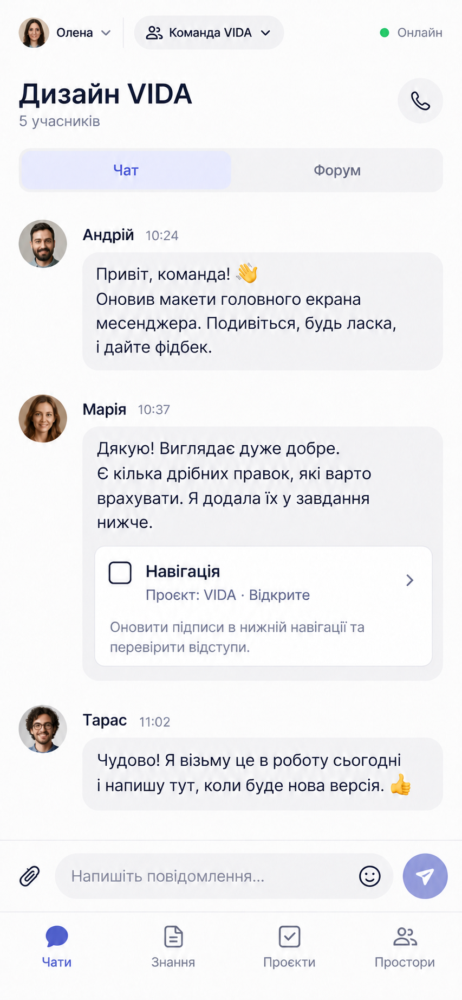
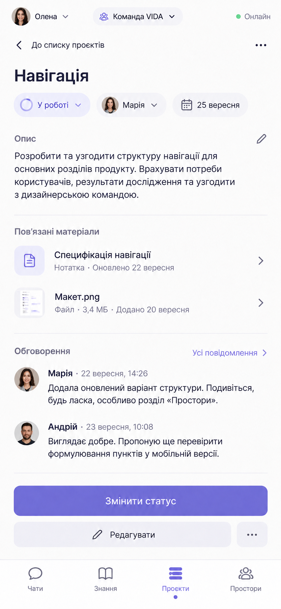
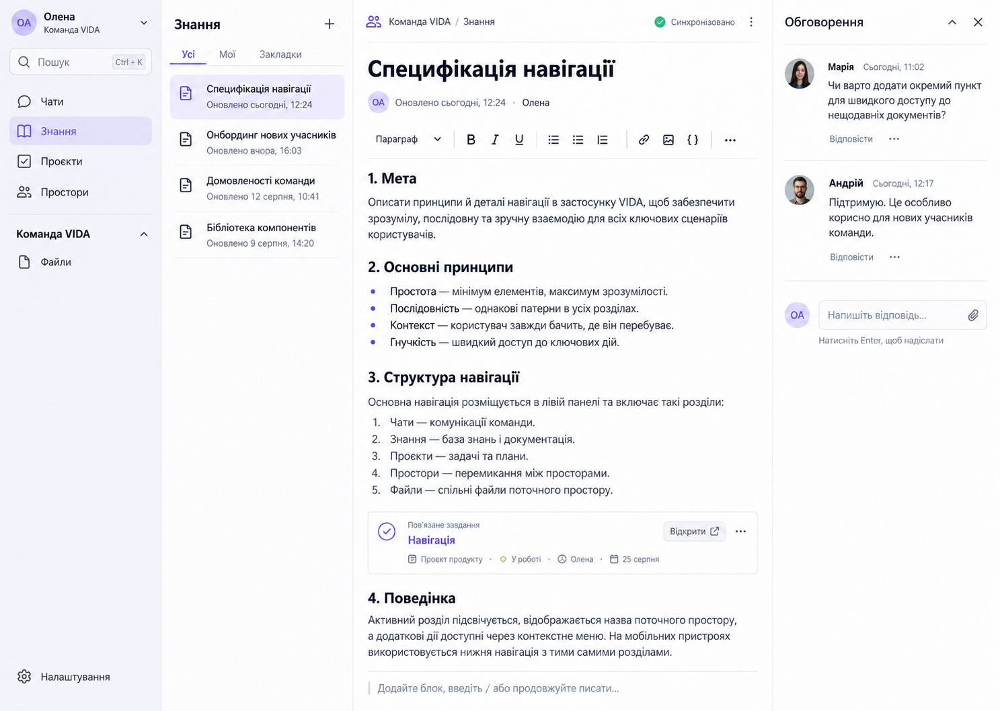

# VIDA layout concepts — review draft

Status: proposal, not an approved visual design. Generated with the built-in OpenAI image-generation tool on 2026-09-22. Source of interaction rules: [EXPERIENCE.md](../EXPERIENCE.md). The three screens are one coherent navigation concept, not three alternative product directions. Generated labels and sample data are illustrative; the implementation must follow approved requirements and accessibility rules.

## Mobile group chat

This v2 image remains the comparison baseline. The user later preferred the compact conversation hierarchy shown in [chat-skill-v3.png](chat-skill-v3.png); see [the comparison slide](chat-skill-comparison-2026-09-22.png). The compactness choice does not approve its color palette, typography or the surrounding navigation proposal.

Recreation prompt: Create a high-fidelity portrait mobile UI mockup for VIDA, a privacy-first collaborative super-app. Show a Ukrainian group chat in a shared Space. Top area distinctly displays active Persona, current Space, and truthful sync status; chat header includes group identity and chat/forum switching. Show a few realistic conversation messages, a linked Project task card, message composer and attachment affordance. Bottom navigation has four stable destinations: Chats, Knowledge, Project, Spaces. Use restrained modern typography, generous whitespace, subtle violet accent, compact but touch-friendly controls. No browser chrome, marketing scene, floating device frame, or city-business content.

## Mobile Project task

Recreation prompt: Create a high-fidelity portrait mobile UI mockup for VIDA in the same visual language as the group-chat mockup. Show a Project task detail in a shared Space: title, status, assignee, due date, subtasks, a linked Knowledge note, a linked File, and a contextual discussion preview. Persona, owning Space and sync state remain visible; header offers one clear contextual action. Use the same four stable bottom destinations: Chats, Knowledge, Project, Spaces. Make task and linked resources easy to scan, with no redundant dashboard, browser chrome, or device frame.

## Windows Knowledge editor

Recreation prompt: Create a high-fidelity wide desktop UI mockup for the installed VIDA Windows client, consistent with the two mobile mockups. Show a Knowledge note in a shared Space. Use an adaptive left navigation rail with Persona/Space and stable destinations, an adjacent note list, a spacious rich-text editor with title, formatting, linked task card, and a right discussion pane. Show a discreet truthful sync state; include search and Files entry. Use concise Ukrainian labels, keyboard-friendly desktop density, restrained violet accent, clean white surfaces. No browser chrome, web-app framing, phone frame, or city-business content.

## Review boundary

- The v2 mobile images replace the misleading global label “Синхронізовано” with “Онлайн”. The v1 files remain only as draft history. Sync of a particular note, message or task must be shown in its own context.
- The task mock still labels its Back route “До списку проєктів”; the actual route should return to the originating task list/board and restore its position. Do not copy this generated label into implementation.
- Validate Persona/Space separation, stable navigation, resource links and contextual discussion before accepting the composition.
- Treat palette, icons, exact copy, generated dates and component styling as placeholders.
- Validate narrow windows, large text, keyboard/screen reader paths and offline/conflict states in later prototypes.
