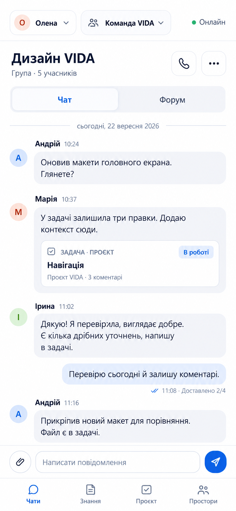
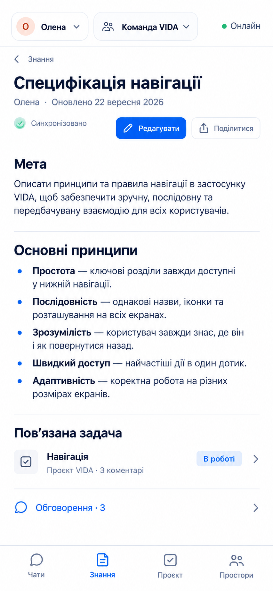
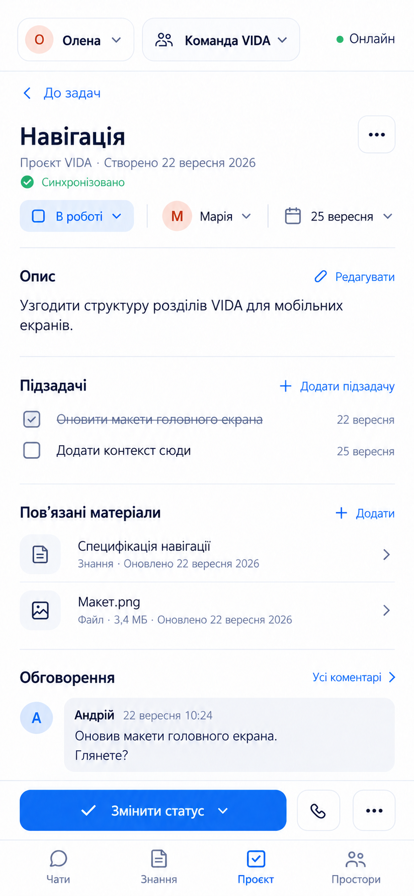

# VIDA mobile direction 1 — selected reference and screen extensions

Status: the user selected the first new group-chat direction and approved the relative information density and block order of the Knowledge and Project extensions. These images are not approved implementation specifications. Generated with the built-in image-generation tool on 2026-09-22 using the installed `ui-ux-pro-max` product guidance for messaging, notes and productivity. No palette, font, icon family, shape or navigation token is approved by these images.

## Chat — selected reference

Prompt brief: 390 × 844 native mobile group chat; preserve approved compact message density; show Persona Олена, Shared Space Команда VIDA, device Онлайн, group Дизайн VIDA, Chat/Forum switch, linked task Навігація, per-message Доставлено 2/4, composer and four destinations. Quiet content-first white surface; navigation visually subordinate to the conversation.

## Knowledge — extension for review

Prompt brief: carry the selected chat's shell and visual hierarchy into a readable note called Специфікація навігації. Show concise prose, a linked task, discussion entry, edit/share actions and resource-specific Синхронізовано distinct from device Онлайн. Give prose more breathing room than chat rows.

## Project — extension for review

Prompt brief: carry the selected chat's shell and visual hierarchy into task Навігація. Show status В роботі, assignee Марія, due 25 вересня, description, two subtasks, linked note and file, a short discussion preview, one primary status action and a resource-specific Синхронізовано label. Back returns to tasks, not the project list.

## Review boundary

- Generated raster mockups are visual references only; labels, spacing and tap-target sizes require verification in a real Flutter prototype.
- The top Онлайн describes this device's reachability; Синхронізовано describes a specific resource receipt. Neither implies message delivery or approval.
- Knowledge and Project density/block order are approved; relation interaction, bottom-navigation placement and exact visual tokens still require review before final EXPERIENCE.md layout rules or DESIGN.md tokens.
