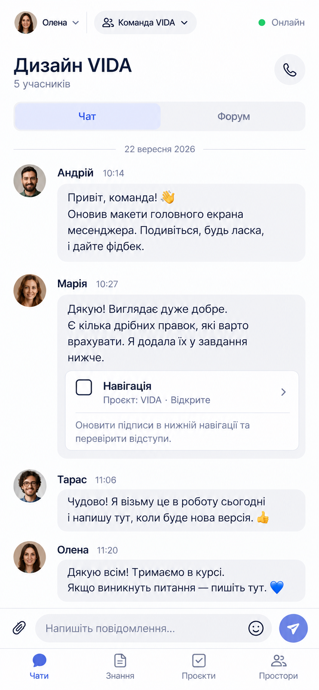
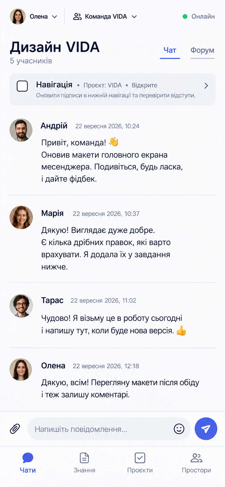
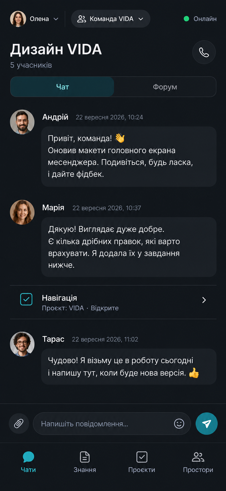

# VIDA mobile conversation — visual exploration

Status: three independent, unselected directions. Generated with the built-in OpenAI image-generation tool on 2026-09-22. The input image for each was [layout-chat-mobile-v2.png](layout-chat-mobile-v2.png), used as functional grounding, not an approved style. The [DESIGN.md](../DESIGN.md) visual tokens remain deliberately open. Generated images illustrate possibilities and are not the implementation contract.

## Quiet Conversation

Prompt: One 390 × 844 full-bleed VIDA mobile group chat for Олена in Команда VIDA, dated 2026-09-22. Conversation is the hero: human-scale text, lightly separated messages, ample reading space, one linked-task preview, compact Chat/Forum switch, composer, and stable Chats/Knowledge/Projects/Spaces navigation. Persona and Space visible; top green-dot Онлайн means connectivity only. Restrained neutral UI with subtle cool accent. No extra feature inventory, nested cards, device or browser chrome.

## Focused Workspace

Prompt: One 390 × 844 full-bleed VIDA mobile group chat, same Persona/Space and user task, dated 2026-09-22. Compact identity/scope header, slim task-context strip under title, denser text-forward chronological stream with hairline separators instead of large bubbles, underlined Chat/Forum tabs, simple composer and the same four stable destinations. Precise high-contrast ink and limited blue-violet accent. Top Онлайн is connectivity only. No extra features, nested cards, device or browser chrome.

## Night Collaboration

Prompt: One 390 × 844 full-bleed VIDA mobile group chat, same Persona/Space and user task, dated 2026-09-22. Distinct dark mode: deep charcoal canvas, warm-white text, restrained teal/cyan accent, compact title, grouped messages, thin inline task row, Chat/Forum switch, simple composer and the same four stable destinations. Top Онлайн is connectivity only. No extra features, nested cards, device or browser chrome.

Do not choose a direction by filenames or generation order in downstream tools. Wait for explicit user selection; then distill chosen traits into DESIGN.md and test the direction on Project, Knowledge and stateful screens.
