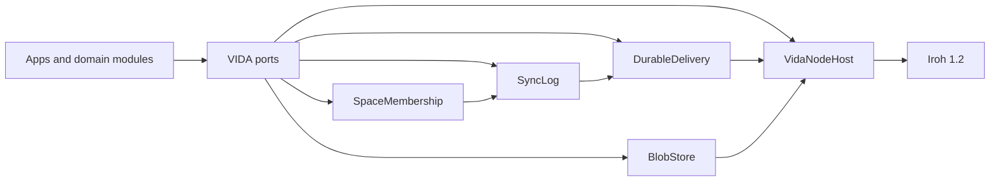

# Transport and replicated-state architecture

## Purpose

Зафіксувати component boundaries, щоб Messenger, Notes, Projects, clients і federated services не створювали несумісні transport, delivery, membership, sync або blob models.

## Components

| Component | Owns | Must not own |
|---|---|---|
| `VidaNodeHost` | Iroh Router, endpoints, Address Lookup, relay/network lifecycle | Persona, Space roles, durable domain history |
| `DurableDelivery` | encrypted enqueue, retry, TTL/quota, delivery ACKs | plaintext, application authorization, canonical state |
| `SpaceMembership` | signed grants/revokes, roles/capabilities, key epochs | transport reachability, endpoint discovery |
| `SyncLog` | policy-validated signed operations, causal repair, snapshots/bootstrap | transient presence, large blob bytes |
| `BlobStore` | encrypted manifests, verified chunks, resumable fetch, pin/GC ownership | Space policy, message ordering |

## Dependency rule



Apps `MUST NOT` depend directly on Iroh or a mailbox implementation. Adapters `MUST NOT` mutate domain state without validated operations.

## State path

```text
command
  → validate authorization and invariants
  → create/sign stable operation
  → atomic origin log + outbox commit (`delivery.accepted`)
  → direct send and/or durable enqueue
  → idempotent receive/apply
  → projections/indexes
  → ACK state updates
```

`delivery.accepted` — лише origin-durable межа. За policy відповідного Space/об'єкта окреме `authority.accepted` може прийти до або після delivery; тільки воно просуває authority-accepted frontier. Локальне tentative відображення `MUST` відрізнятися від accepted projection.

Для прямого з'єднання цей ескіз розгорнуто в [контур сесії](../04-specifications/device-sync-session.md): device binding → control/membership/epoch reconciliation → scoped causal summary/repair → validation → merge/projection/ACK. Контур має статус `review`; пристрої однієї Persona рівноправні (`ADR-0016`), а для непорівнюваних несумісних status/file змін затверджено явний conflict без winner ([ADR-0017](decisions/ADR-0017-concurrent-status-file-conflict.md)). Proof/формат та інші operation families лишаються `OQ-0033`/`OQ-0034`.

## Data-plane rules

- transient signals: gossip/datagram/stream; recover through state refresh;
- durable mutations: signed operation log plus pull/reconcile;
- immutable large content: encrypted manifest plus content-addressed verified chunks;
- canonical control: signed Space membership, role grant and key-epoch operations.

## Deployment envelope

- clients MAY communicate directly or through Iroh relay;
- first-party static Web є Release-1 client under [ADR-0021](decisions/ADR-0021-static-web-client-in-release-1.md): усі peer-data profiles пробують прямий шлях першими й використовують VIDA-operated encrypted relay як fallback; stock browser Iroh/Wasm є relay-only, тож прямий WebRTC/custom transport для Web проходить окремий prototype/conformance gate; relay services remain distinct from client implementations;
- durable delivery nodes are application services, not Iroh relays;
- self-hosted/federated delivery topology is deferred to prototype evidence;
- node and adapter implementations MUST expose compatibility and lifecycle diagnostics without secret material.

Operational ownership is split explicitly: client/runtime teams own endpoint lifecycle and local recovery; delivery operators own ciphertext durability, quota, abuse controls and deletion evidence; Space authority operators own control-log ordering and authorization receipts. A deployment `MUST` name each owner before production enablement.

## Deferred

Wire schema, mailbox topology, blob encryption/digest details, Address Lookup provider, persistence engine, workload-specific CRDT and performance SLO values.

These are implementation gates, not free choices: no independent implementation may claim interoperability or production readiness for a deferred seam until its linked open question (`OQ-0027`–`OQ-0034`) is closed by an accepted ADR/specification with conformance fixtures.
